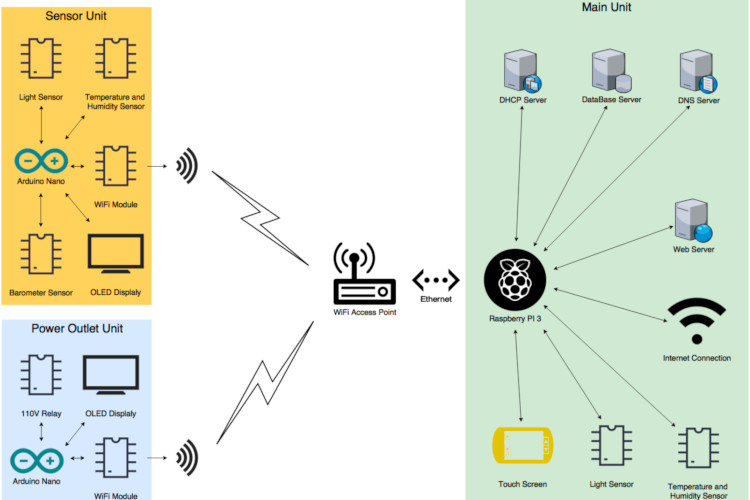
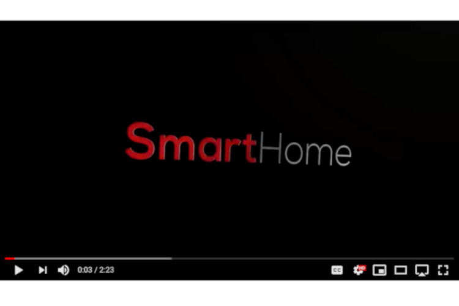

# smart-home
Smart Home 

This​ ​project​ ​of​ ​smart​ ​home​ ​is​ ​couple​ ​of​ ​devices​ ​that​ can​ ​control​ ​specific​ ​power outlets,​ ​collect​ ​information​  from​ ​home​ ​environment​ ​(temperature,​ ​humidity,​ ​light,​ ​air pressure)​ ​and​ ​those​ ​devices​ ​can​ ​communicate​ ​with​ ​its​ ​main​ ​unit.​ ​Based​ ​on​ ​data received,​ ​main​ ​unit​ ​will​ ​be​ ​able​ ​to​ ​set​ ​some​ ​criteria​ ​to​ ​turn​ ​on​ ​or​ ​off​ ​power​ ​outlets. Moreover,​ ​user​ ​will​ ​be​ ​able​ ​to​ ​control​ ​those​ ​smart​ ​outlets,​ ​and​ ​get​ ​information​ ​from sensor​ ​units​ ​on​ ​main​ ​unit​ ​touch​ ​screen​ ​or​ ​on​ ​mobile​ ​device​ ​using​ ​internet​ ​browser.

Project Demo Video:  

For more information and schematics plese see [final report](Docs/Final_Report.pdf) in Docs folder.

Authors: 
- Alex Viznytsya
- Michal Bochnak
- Artur Wojcik

This project was semester long group project at UIC, CS-362 Computer Design class.

